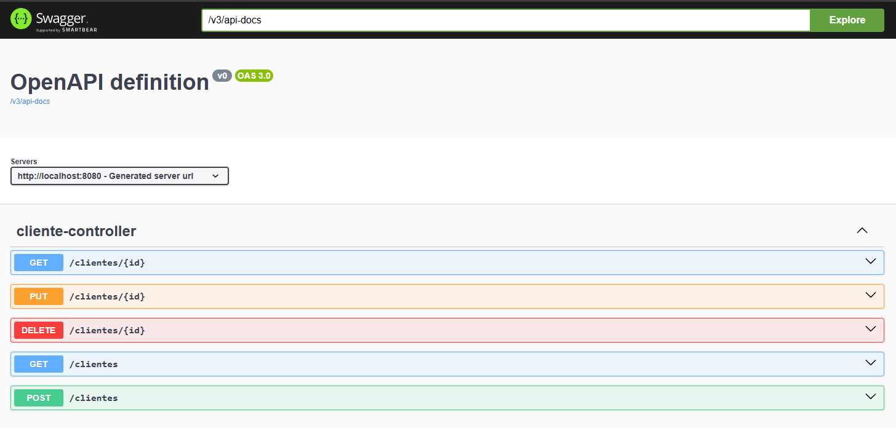

## Cliente com endereço

Aplicação que completa o endereço do cliente com base no CEP passado.

### Tecnologias utilizadas

- **Java**: Linguagem de programação fortemente tipada e orietada a objetos;
- **Spring Boot**: Framework que traz diversos mecanismos que facilitam a criação de aplicações Java, inclusive APIs Rest, como esse projeto;
- **Spring Data JPA**: Módulo do Spring que ajuda interação com banco de dados simplificando o uso do JPA;
- **OpenFeign**: Biblioteca para chamadas HTTP;
- **Swagger**: Útil para documentação e testes das chamadas da API.

### Documentação Swagger

Após rodar aplicação, acessar o seguinte endereço:

http://localhost:8080/swagger-ui/index.html

### Endpoints

